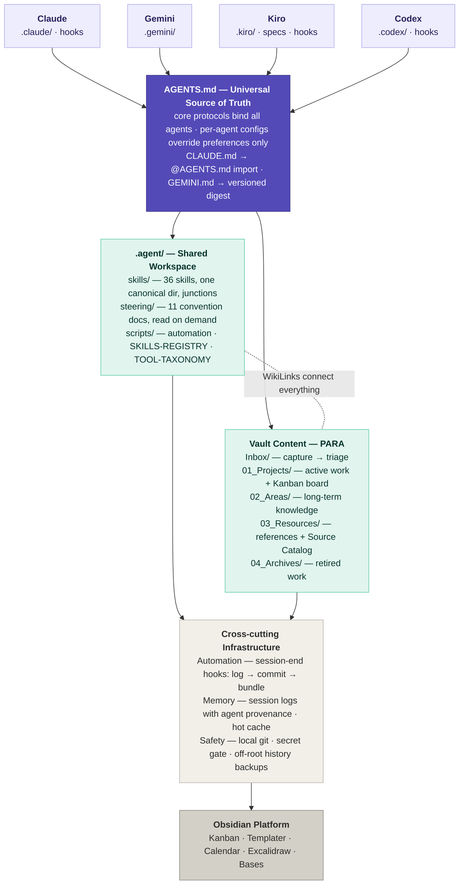

# Agentic Vault Template

**An Obsidian vault template for working *with* AI agents — PARA + Zettelkasten organization, a multi-agent governance layer, 36 reusable agent skills, and hands-off automation (session logs, git snapshots, off-site backups).**

This is the architecture of a real, daily-driven personal knowledge management system, stripped of its contents and packaged so you can start your own. It assumes you use one or more AI coding agents (Claude Code, Gemini CLI, Kiro, Codex, etc.) alongside Obsidian — and it gives those agents a constitution, a shared toolbox, and guardrails.

---

## Why this exists

Most vault templates organize *notes*. This one also organizes *agents*. When AI assistants work inside your knowledge base, three problems appear fast:

1. **Every agent behaves differently** — different conventions, different file habits, no shared rules.
2. **Work evaporates between sessions** — no logs, no provenance, no way to resume.
3. **One bad command can destroy notes** — and most vaults have no undo.

This template answers all three with a governance layer (`AGENTS.md`), session continuity (auto-logged sessions), and a local git safety net (auto-snapshot on session end, secret-gated, with off-site history bundles).

## The architecture



**PARA** answers *"where does this live?"* — content flows Inbox → Projects → Areas/Resources → Archives.
**Zettelkasten** answers *"how does this connect?"* — atomic notes, 3-5 wikilinks each, emergent structure.
**AGENTS.md** answers *"how do agents behave here?"* — one constitution, every agent bound by it.

## What's in the box

| Piece | What it does |
|---|---|
| **`AGENTS.md`** | The constitution: directory contracts, operational protocols, conflict-resolution table, steering priority. Agent-specific configs may override *preferences*, never *protocols*. |
| **`CLAUDE.md` / `GEMINI.md`** | Claude imports AGENTS.md directly; Gemini gets a version-marked digest. `sync-agents.ps1` detects drift. |
| **36 agent skills** (`.agent/skills/`) | Reusable workflows any agent can run: inbox triage, atomic note creation, vault Q&A, wiki compilation, concept extraction, contradiction reconciliation, document conversion, media transcription, skill validation, security audit, and more. One canonical directory; every agent's `skills/` is a junction to it. |
| **11 steering docs** (`.agent/steering/`) | Conventions read on-demand, not preloaded: skills standard, file naming, tag taxonomy, security practices, session continuity, bi-temporal fact tracking, the two-output rule. |
| **`TOOL-TAXONOMY.md`** | Generic capability names (`file-read`, `content-search`) so skills stay portable across agents. |
| **Automation scripts** (`.agent/scripts/`) | `vault-git-commit.ps1` (secret-gated auto-snapshot), `vault-session-log.ps1` (deterministic session logs), `vault-git-bundle.ps1` (monthly off-root history backup), `sync-agents.ps1` (governance drift check), `purge-desktop-ini.ps1`. |
| **Hooks for 3 harnesses** | Claude Code `SessionEnd`, Codex `Stop`, Kiro `agentStop` — all converge on: write session log → snapshot vault to git → (monthly) bundle history off-root. |
| **Kanban work board** | `01_Projects/To Do.md` — the authoritative "what am I working on" that agents check and update. |
| **Index scaffolds** | `AREA-INDEX`, `RESOURCE-INDEX` (with a Source Catalog — every source you encounter gets a row), `ARCHIVE-INDEX`, archive taxonomy. |
| **Seed examples** | One fictional note per convention (inbox capture, project + card, area note with a bi-temporal timeline, resource with catalog row) so you can see each pattern in action. |

## Quick start

```powershell
# 1. Use this template (GitHub) or clone, then:
cd your-vault
pwsh -NoProfile -ExecutionPolicy Bypass -File setup.ps1
```

`setup.ps1` creates the skills junctions (git can't store them), initializes the local git safety net, and prints the remaining steps:

1. **Open the folder as a vault in Obsidian.** Recommended community plugins: Kanban, Templater, Calendar, Excalidraw, Bases.
2. **Personalize `AGENTS.md`** — fill in the `{{OWNER_NAME}}` / focus placeholders (mirror in `GEMINI.md` and `.agent/steering/memory-hot-cache.md`). This is how agents know whose vault they're in.
3. **Point your agent at the vault** (e.g., run `claude` in the vault root). Say *"triage my inbox"* or *"write a note about X"* and watch the skills fire.
4. Delete the seed examples once you've seen how the conventions look.

### Requirements

- **Obsidian** (free) — the vault works as plain Markdown without it, but the Kanban/Bases views need it
- **PowerShell 7+** (`pwsh`) and **git** — for the automation scripts
- At least one **AI agent harness** (Claude Code, Gemini CLI, Kiro, Codex, …) — the vault is useful without one, but agents are the point
- Windows-first (junctions, PowerShell); the architecture ports to macOS/Linux with symlinks + minor script edits — PRs welcome

## The ideas worth stealing (even if you don't use the template)

- **One constitution, many agents.** Agent configs multiply; protocols shouldn't. `AGENTS.md` is the single source of truth, and satellite files (`CLAUDE.md`, `GEMINI.md`) are pointers/digests with drift detection — never copies.
- **Skills as a shared, validated library.** Skills live once in `.agent/skills/`, follow a documented standard (SKILL.md + README.md, agent-agnostic tool names), and every agent sees the same set through junctions.
- **Session end = log + snapshot.** Every agent session deterministically writes what changed and commits a vault snapshot through a secret gate. You get provenance (`agent:` frontmatter on every log) and undo, for free.
- **Git as a background safety net, not a user-facing tool.** The owner never runs git. Agents do, automatically, with guardrails (secret patterns, nested-repo exclusions, cloud-sync workarounds).
- **Bi-temporal fact tracking.** Entity notes record *when a fact was true* vs *when the vault learned it* — an append-only `timeline` in frontmatter, so "what did I believe about X in March?" is answerable.
- **Steering on demand.** Agents read convention docs when the action demands them (creating a file → naming conventions), not as a giant preload.

## Repository layout

```
├── AGENTS.md / CLAUDE.md / GEMINI.md     governance
├── setup.ps1                             one-time setup (junctions + git)
├── Inbox/                                capture → triage
├── 01_Projects/  (To Do.md board)        active work
├── 02_Areas/     (AREA-INDEX.md)         long-term knowledge
├── 03_Resources/ (RESOURCE-INDEX.md)     references + Source Catalog
├── 04_Archives/  (ARCHIVE-INDEX.md)      retired work, taxonomy in specs/
├── System/
│   ├── templates/                        note templates
│   ├── session-logs/YYYY-MM-DD/          per-session agent logs
│   └── memory/                           glossary, people, projects
├── .agent/                               shared agent workspace
│   ├── skills/        36 skills (canonical)
│   ├── steering/      11 convention docs
│   ├── scripts/       automation
│   ├── outputs/       agent deliverables
│   ├── SKILLS-REGISTRY.md
│   └── TOOL-TAXONOMY.md
├── .claude/  .codex/  .kiro/  .gemini/   per-agent configs + hooks
└── .gitignore                            notes+config scope, secrets excluded
```

## FAQ

**Do I need all four agent harnesses?** No — one is plenty. The hooks are per-harness; unused ones are inert.

**Does this work without Obsidian?** Mostly. Everything is plain Markdown; you lose the Kanban/Bases rendering and the `obsidian-cli` skill.

**Why local-only git with bundles instead of a private GitHub repo?** A knowledge vault is intimate. Local git gives undo without putting your notes on someone else's server; the bundle backup covers disk failure. If you *want* a remote, add one — nothing breaks.

**How do I add my own skills?** Ask your agent to run the `skill-creator` skill, or copy an existing skill directory and follow `.agent/steering/skills-standard.md`. Validate with `validate-skills-standard`.

## License

MIT — see [LICENSE](LICENSE).
